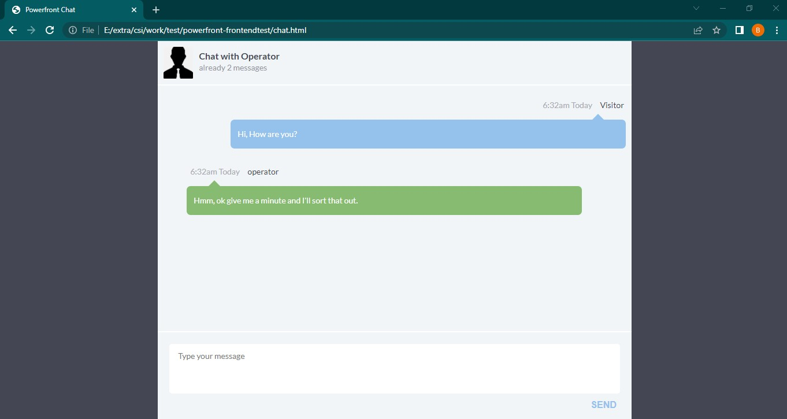
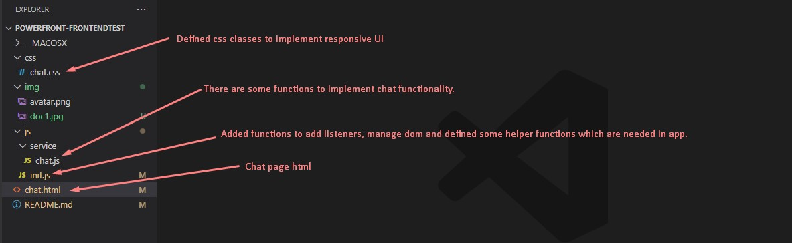

## Requirements
### Must
- Create a new JS file to handle the display of the live chat program
- Use the supplied function 'chat.getChatHistory(callback)' to load and display the chat
history in the '#chatHistory' container. This will simulate a server request for data
- Use the supplied function 'chat.sendChat(message)' to send a chat typed into the input
box - Bind to the event "chat received" using "chat.addListener('chat received', function
(data) { ... })" to receive and display any chats sent, as well as the dummy responses
- Display chat messages with datetime, from and message
- Modify the existing HTML and CSS files as required
- Fix any existing bugs in the code
- Add styling, this is a front end developer test. Style matters
- The app should be well presented with a clear and amazing UI
### Bonus
- Implement responsive design
- Protect against XSS and other forms of hacking
- Display the time in the readable format. Be creative
- Add some animations when the messages are added to the history
- Fix the message textarea and button to the bottom of the page
- Make the User Experience as simple as possible
- Convert the code to not rely on jQuery

## What I have done?
### UI and project structure

<picture>
    
    
</picture>

### Description
- Implemented responsive UI (added css classes in css/chat.css, fixed chat.html).
- Fixed bugs in chat.js and added some functions to add message data to localStorage and functions to show spinners until receive other's message.
    * There was an critical issue in addListener function in chat.js.
    * Added saveChatHistory() function and fixed getChatHistory(), dispatchChatEvent(), sendChat().
- Added listeners and defined some helper functions in init.js.

### For the bonus
- Responsive Design - done
- Wrote js codes to protect against XSS without jQuery.
- Display message time in readable format. ex: "6:32am Today"
- Add some animations when the messages are added to the history - done
- Fix the message textarea and button to the bottom of the page - done
- For the UX, display spinner during other is typing and send message when press ctrl+Enter.

#### * spent time: more or less 3hours